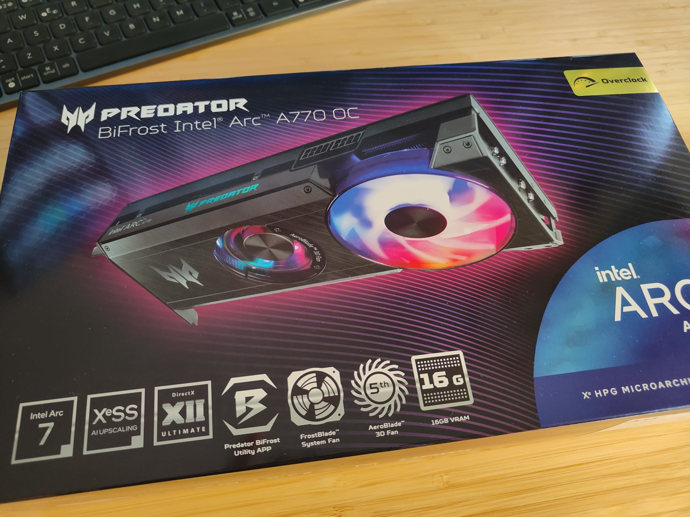
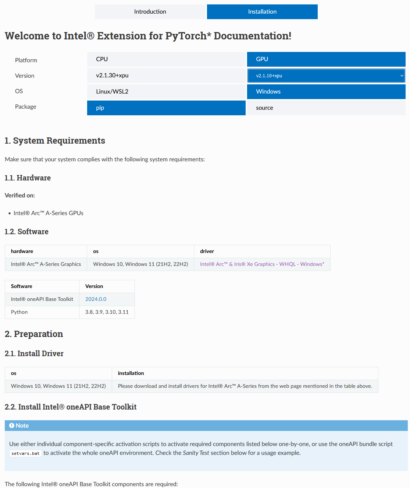

# IntelArcA770

Samples running deep learning models on Intel GPU Arc A770 on Windows, natively using Intel extension for PyTorch.



## Samples

- [llama2](./src/llama2) - Inference & Chat with Llama-2-7b-hf model
- [llama3](./src/llama3) - Inference & Chat with Llama-3-8B model
- [phi3](./src/phi3) - Chat with Phi-3-mini-4k-instruct model

## Windows native setup

Intel provides a [comprehensive guide](https://intel.GitHub.io/intel-extension-for-pytorch/index.html#installation) to get ready the python extension for the Arc GPU. However, setting up the Arc A770 GPU on Windows require some initial adjustments and a bit of troubleshooting. Here’s a detailed walkthrough of the setup process.



### 1. Installing Intel GPU Drivers and oneAPI Base Toolkit

Download the latest graphics driver for the Intel Arc A770 GPU from the [Intel website](https://www.intel.com/content/www/us/en/download/785597/intel-arc-iris-xe-graphics-windows.html). Then, install the driver following the on-screen instructions. A reboot may be required after installation.

Next, download the Intel oneAPI Base Toolkit from the [Intel website](https://www.intel.com/content/www/us/en/developer/tools/oneapi/base-toolkit-download.html). Install the toolkit by running the installer and following the on-screen instructions.

### 2. Installing PyTorch and Intel Extension

I recommend using mamba or conda to create a new python environment, so everything is isolated from your current setup. Here is a step-by-step powershell script to install the necessary requirements:

```pwsh
mamba create -n arcA770 python=3.11
mamba activate arcA770
Install-Module Pscx -Scope CurrentUser -AllowClobber
Invoke-BatchFile 'C:\Program Files (x86)\Intel\oneAPI\setvars.bat'
mamba install pkg-config libuv
python -m pip install torch==2.1.0a0 torchvision==0.16.0a0 torchaudio==2.1.0a0 intel-extension-for-pytorch==2.1.10 --extra-index-url https://pytorch-extension.intel.com/release-whl/stable/xpu/us/
python -m pip install setuptools==69.5.1
pip install numpy==1.26.4
```

Here you may notice some tweaks over the official guide. The first one is the usage of Pscx powershell extension. This enables the `Invoke-BatchFile` command, which is used to set the oneAPI environment variables. The second one is the installation of `setuptools` and `numpy==1.26.4`, that are required to avoid some compatibility issues.

`torchvision` and `torchaudio` are optional, but I included them to have a complete environment.

>💡setvars.bat
>
> The `Invoke-BatchFile` command is used to run the `setvars.bat` script that sets the environment variables for the oneAPI toolkit. This script is located in the oneAPI installation directory. The path may vary depending on the installation directory you chose.
>
> Working on Windows with mamba, you may find that the PATH environment variable gets too long, which can be problematic when running the `setvars.bat` script. To avoid this issue, there is included the `setup_vars.ps1` script that sets the necessary environment variables for the Intel extension for PyTorch while avoiding this issue.
>
> ```pwsh
> mamba activate arcA770
> ./setup_vars.ps1
> ```

### 3. Sanity test

Before continuing, check that everything is correctly installed by running the following command:

```pwsh
python -c "import torch; import intel_extension_for_pytorch as ipex; print(torch.__version__); print(ipex.__version__); [print(f'[{i}]: {torch.xpu.get_device_properties(i)}') for i in range(torch.xpu.device_count())];"
```

### 4. Install transformers library and other dependencies

Once intel extension is correclty setup, install the `transformers` library and other dependencies required for running the LLMs.

```pwsh
python -m pip install transformers==4.37.0 accelerate sentencepiece
```

### 5. Get access to the models

Finally, it is necessary to login to [huggingface](https://huggingface.co/) in order to download the models. To do so, before running the following script, go to [huggingface](https://huggingface.co/), sign-up or login, and get a new read token from settings. Then, run the following command, pasting the token when prompted.

```pwsh
huggingface-cli login
```

It is also need to request access for the models we are using. Go to the [Llama2](https://huggingface.co/meta-llama/Llama-2-7b-hf), [Llama3](https://huggingface.co/meta-llama/Meta-Llama-3-8B) and [Phi3](https://huggingface.co/microsoft/Phi-3-mini-4k-instruct) models and request access. Usually within the same hour you will get access.

### 6. Phi3 requirements

For Microsoft Phi3 model, it is necessary to install the prerelease pytorch extension version, and then reinstall transformers package. To do so, run the following command:

```pwsh
pip install --pre --upgrade ipex-llm[xpu] --extra-index-url https://pytorch-extension.intel.com/release-whl/stable/xpu/us/
pip install transformers==4.37.0
```

## Run

Modify the prompts as desired, then set the environment variables and run the sample.

```pwsh
mamba activate arcA770
./setup_vars.ps1
python -W ignore ./src/phi3/chat.py
```
